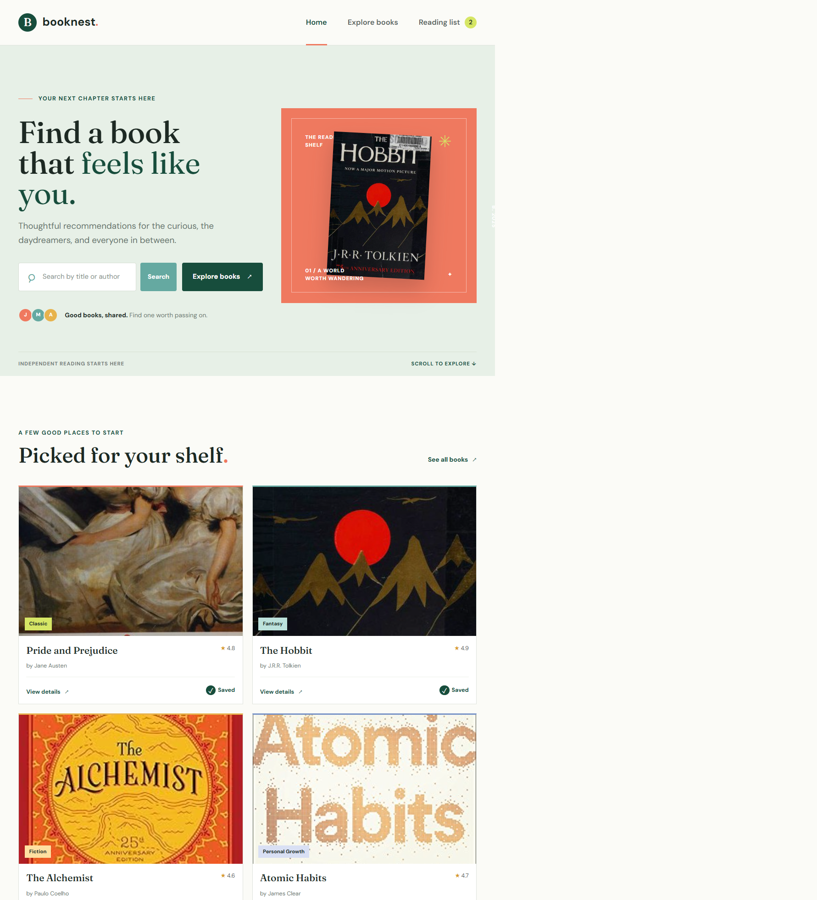
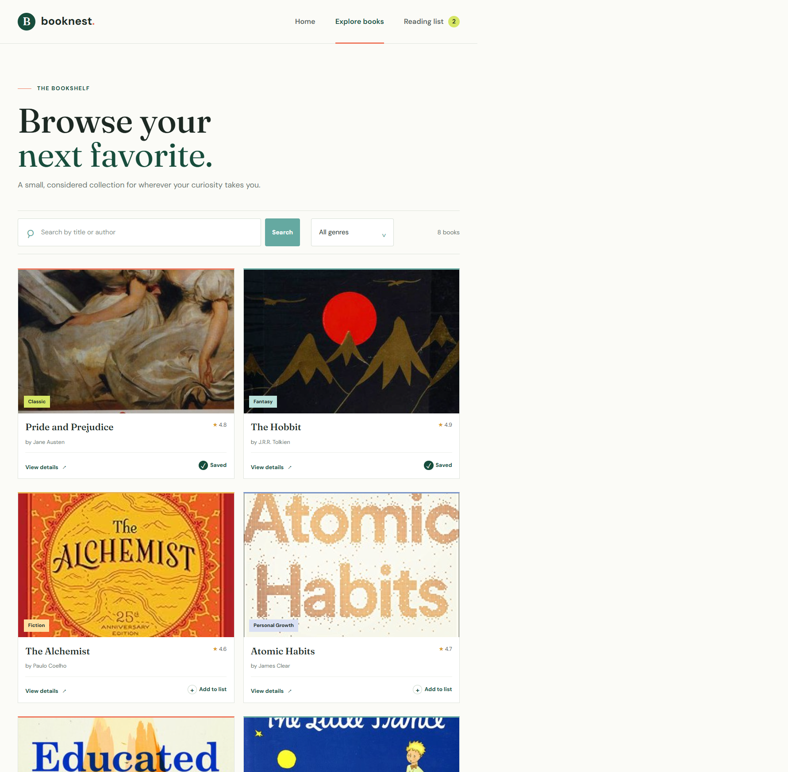
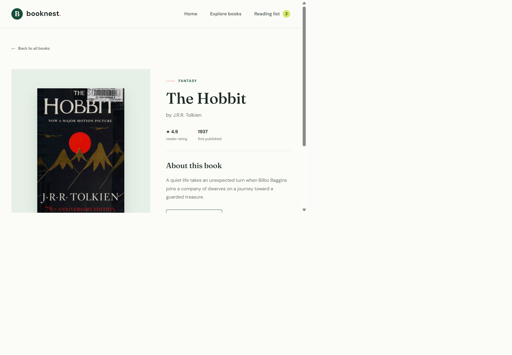
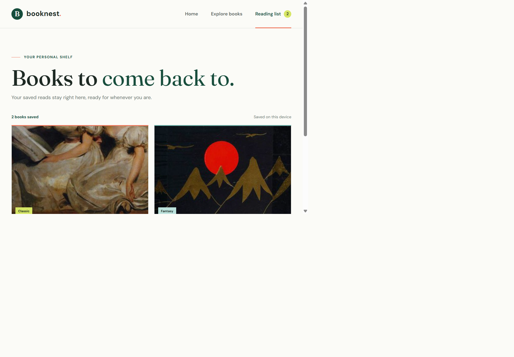

# BookNest – Book Discovery and Reading List Application

## 1. Problem Statement

Readers often discover books in different places and need a simple way to search a collection, explore genres, and remember books they want to read. BookNest brings those tasks together in one responsive interface.

## 2. Project Objective

Build a React mini application demonstrating reusable components, parent–child props, state, hooks, forms, event handling, client-side routing, responsive styling, and an Express API.

## 3. Technologies Used

- React and Vite for the client application
- React Router for client-side pages and URL parameters
- Express for JSON API routes
- Plain CSS for responsive styling
- Browser `localStorage` for persisting the reading list
- Open Library cover images for book artwork

## 4. Tutorial Selection

YouTube tutorial selection, approval, and video link are omitted as requested. BookNest is a personalized project implementation.

## 5. System and Component Structure

```text
server/
  index.js                 Express API routes
src/
  components/
    BookCard.jsx           Reusable book item
    BookList.jsx           Renders a collection of cards
    CategoryFilter.jsx     Genre selection input
    Footer.jsx             Shared page footer
    Navbar.jsx             Shared navigation and saved count
    ReadingListSummary.jsx Class component showing saved count
    SearchBar.jsx          Controlled search form
  data/
    books.js               Eight sample book records
  pages/
    BookDetails.jsx        API-loaded book details
    Books.jsx              API-loaded searchable catalog
    Home.jsx               Home page and featured books
    ReadingList.jsx        Saved books page
  App.jsx                  Shared state and route definitions
  index.css                Global and responsive styles
```

## 6. Important React Concepts Implemented

- **Functional components:** App, pages, and reusable UI components are function components.
- **Class component:** `ReadingListSummary` extends React's `Component` class and receives `bookCount` through props.
- **Parent–child communication:** App passes the reading list and toggle callback down through pages, `BookList`, and `BookCard`.
- **Props:** Book information, saved state, counts, and event callbacks are passed to child components.
- **State with `useState`:** App owns search text, selected genre, and reading-list state. Pages also own API loading and result state.
- **Side effects with `useEffect`:** Books and Book Details load data from Express when opened. App synchronizes saved books with `localStorage`.
- **Form and events:** Search is a controlled form. `onChange` updates search text and `onSubmit` opens the catalog. Buttons use `onClick` to add or remove books.
- **Dynamic rendering:** `.map()` creates book cards and `.filter()` matches search and genre. Empty, loading, error, and not-found states are conditional.
- **Routing:** React Router serves `/`, `/books`, `/book/:id`, and `/reading-list`. `useParams()` reads a book ID from the URL.
- **Express API:** `GET /api/books`, `GET /api/books/:id`, `GET /api/reading-list`, `POST /api/reading-list`, `DELETE /api/reading-list/:id`, and `GET /api/health` return JSON. Vite proxies `/api` requests to Express during development.

The browser reading list persists in `localStorage`. Express keeps an in-memory copy for API demonstration; that server copy resets when the API process restarts.

## 7. Screenshots

The app screenshots are stored in `public/screenshots/`.

### Home



### Books Catalog



### Book Details



### Reading List



## 8. Modifications and Additional Features

1. Search by title or author.
2. Filter the catalog by genre.
3. Save and remove books from a reading list persisted in the browser.
4. Add book details routes, loading/error states, and an Express JSON API.

## 9. Challenges Faced

- Connecting the Vite client and Express API through a development proxy while keeping a single `npm run dev` command.
- Keeping the reading list available after refresh while demonstrating server-side POST and DELETE routes.
- Handling unknown book IDs, empty search results, and API loading or failure states.

## 10. Conclusion

BookNest demonstrates the required React concepts in a complete multi-page application, combining reusable components and interactive state with responsive CSS and a working Express API.

## 11. GitHub Link

https://github.com/monika730/booknest
